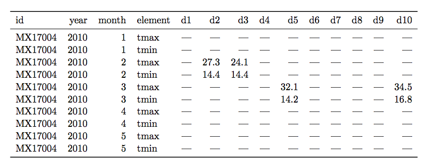
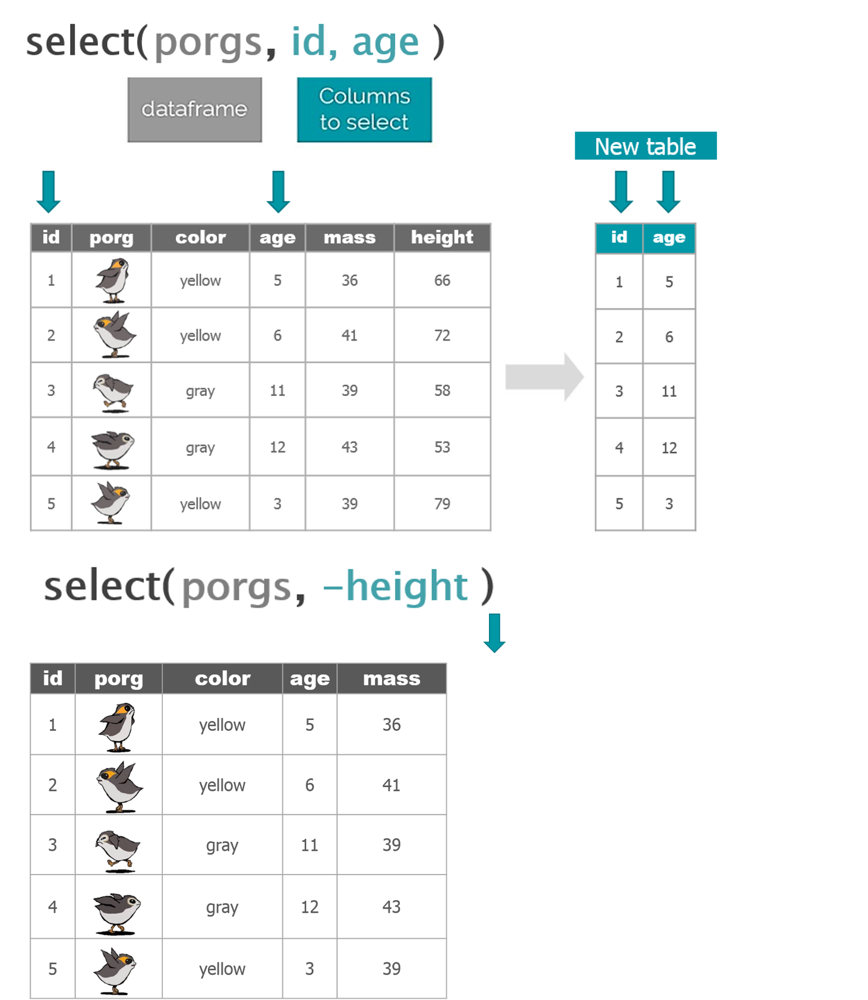
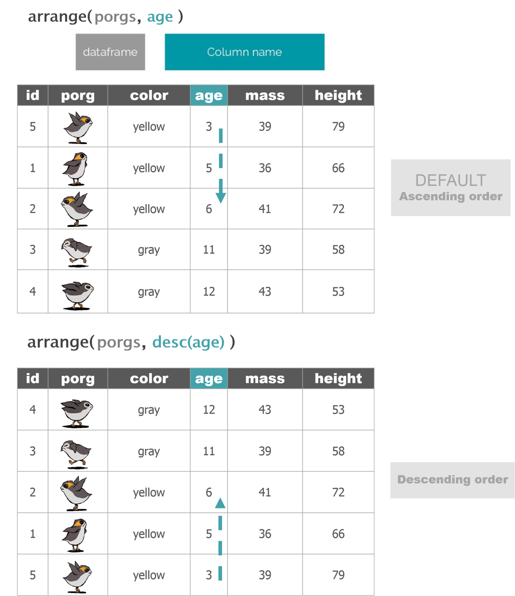
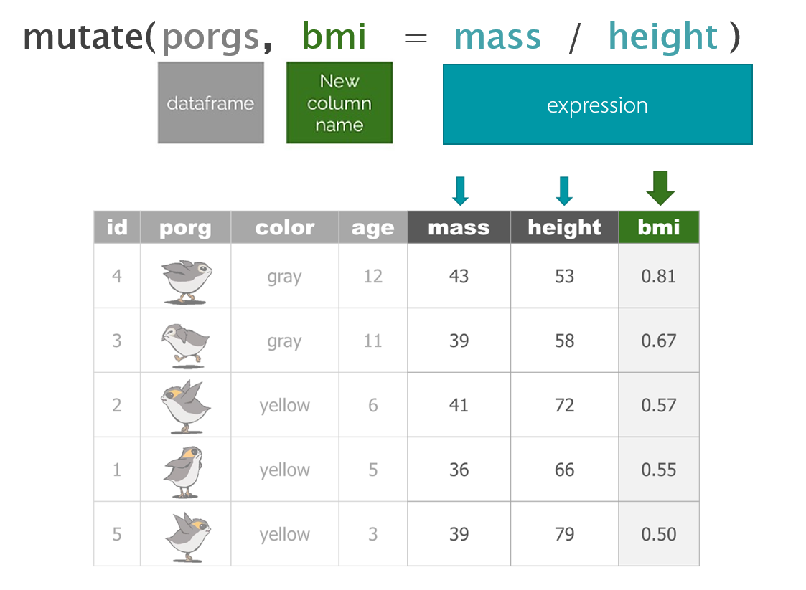

```{r setup, include=FALSE}
library(rmarkdown)
library(knitr)
library(magrittr)


knitr::opts_chunk$set(error=TRUE, color = NULL, message = FALSE)
htmltools::tagList(rmarkdown::html_dependency_font_awesome())

source("https://raw.githubusercontent.com/MPCA-air/r-modules/master/R/hook_add_color.R")
source("https://raw.githubusercontent.com/MPCA-air/r-modules/master/R/hook_add_mod.R")

```

# A New Week! {-}
<hr class="hr2">

<center>
{width=350px}
</center>

<br>

We aren't computer scientists and that's okay! 

We make lots of mistakes. Mistakes are funny. You can laugh with us.

Let's go, Simba, Pumbaa, and Timon!

<br><br><hr class="hr2">

<br>

# Tidy data
<hr>

In tidy data:

::::{.card data-latex=""}


* Each variable forms a column.

* Each observation forms a row.

* Each type of observational unit forms a table
    
::::
<center>
{width=650px}
</center>

An example of tidy data: 

```{r}

head(airquality, 10)

```

An example of a messy dataset:

<center>
{width=650px}
</center>

<br>


# Manipulate data
<hr>
<div style="float: left; width: 20%;">
{width=150px}
</div>

<div style="float: right; width: 80%;">

dplyr is the hero for most analysis tasks. 

With these six functions you can accomplish just about anything you want with your data.

::::{.card data-latex=""}

* __select()__ : select individual columns to keep or drop

* __arrange()__: sort a table top-to-bottom based on the values of a column

* __mutate()__: add new columns or dupate exsiting columns

* filter(): keep only a subset of rows depending on the values of a column

* summarize(): calculate a single summary for an entire table

* group_by(): sort data into groups based on teh vales of a column


::::

</div>

<br><br><br><br>

<br><br><br><br>

<br><br><br><br>

## select()

Use the select() function to:


* Pull-out a few columns to create a new table

* Drop columns you no longer need <br>

* Rearrange or change the order of columns

<center>

{width=700px}

</center>

<br>

<br>

### Keep certain columns

```{r, eval=F}
library(dplyr)

select(airquality, Ozone, Month, Day) # keet Ozone, Month, and Day columns

select(airquality, c(Ozone:Temp))

```


### drop one or more columns

```{r, eval=F}

colnames(airquality) # display column names

select(airquality, -Wind) # drop the wind column

select(airquality, -c(Solar.R:Temp)) # drop multiple columns

```

### reorder columns

```{r, eval=F}

# Move Month and Day columns first and keep everthing else the same
select(airquality, Month, Day, everything())
       
```


::::{.quiz data-latex="Exercise 1"}

__Exercise 1__

import ozone data from ozone_samples_demo.csv <br>

drop the Latitude and Longitude columns <br>

select SITE, Date, Ozone, UNITS columns <br>

::::


<br>

## arrange()

Use arrange() to sort the rows of a data frame based on the values of selected columns

<center>

{width=700px}

</center>


```{r, eval=F}

arrange(airquality, Ozone) # arrange rows based the value of ozone, the smallest on top

arrange(airquality, desc(Ozone)) # from high to low

```

::::{.quiz data-latex="Exercise 2"}

__Exercise 2__

Try arranging more than one column, such as Ozone and Temp. What happens?

Create a new airquality data frame showing top 10 ozone days, with Month, Day and Ozone columns

::::


## mutate()

mutate() can edit existing columns in a data frame or add new values that are calculated from existing columns.

<center>

{width=700px}
</center>

### Add a column

First, let’s add a column with the city of ozone measurement. 

```{r, eval=F}

airquality <- mutate(airquality, city = "New York") # add city as a colum 

```


### Add several columns

Let’s also add a new column to document the data measurement year.

```{r, eval=F}
# Add some information about city and year
airquality <- mutate(airquality, 
                     city = "New York",
                     year = 1973)

```


### Change a column
```{r, eval=F}
#set city to lower case
airquality <- mutate(airquality,
                     city = tolower(city))

# toupper() changes all of the letters to upper-case.
```


### Add calculated columns

We can use mutate() to convert the Wind column from mph to m/s.  Multiply the Wind column by 0.447 to get new values for a column named wind_meter.per.second.

```{r, eval=F}

airquality <- mutate(airquality,
                     Wind_m.s = Wind * 0.447)


```

::::{.quiz data-latex="Exercise 3"}

__Exercise 3__

Convert the Temp colum from Fahrenheit to Celsius using T(°C) = (T(°F) - 32) * 5/9 

::::


# Recap
<hr>

::::{.tip data-latex=""}
<br>

* tidy data

* select()

* arrange()

* mutate()

::::


