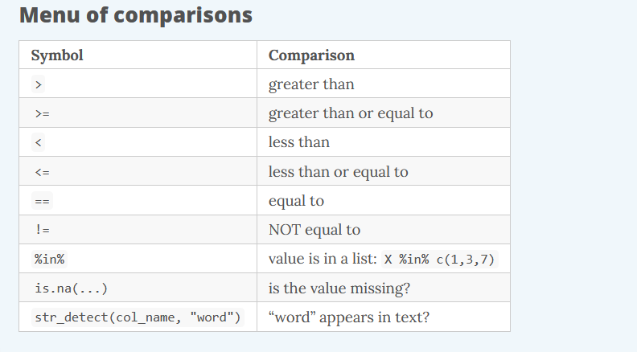

```{r setup, include=FALSE}
library(rmarkdown)
library(knitr)
library(magrittr)


knitr::opts_chunk$set(error=TRUE, color = NULL, message = FALSE)
htmltools::tagList(rmarkdown::html_dependency_font_awesome())

source("https://raw.githubusercontent.com/MPCA-air/r-modules/master/R/hook_add_color.R")
source("https://raw.githubusercontent.com/MPCA-air/r-modules/master/R/hook_add_mod.R")

```

# A New Week! {-}
<hr class="hr2">

<center>
{width=350px}
</center>

<br>

We aren't computer scientists and that's okay! 

We make lots of mistakes. Mistakes are funny. You can laugh with us.

Let's go, Simba, Pumbaa, and Timon!

<br><br><hr class="hr2">

<br>

# Comparing values
<hr>

We use a variety of comparisions when processing data. For example, we only want concentrations above a certain level, or months in summer, or sites that have missing observations. 

We the following relational operators to find the data we want. 

<center>
{width=750px}
</center>

::::{.quiz data-latex="Exercise 1"}

__Exercise 1__

Try comparing some things to see if you get what you’d expect. 

4 != 5

4 == 4

4 < 3

4 > c(1, 3, 5)

5 == c(1, 3, 5)

5 %in% c(1, 3, 5)

2 %in% c(1, 3, 5)

2 == NA

::::

Missing values (NA) are regarded as non-comparable even to themselves, so comparisons involving them will always result in NA


<br><br><br><br>

# Pipe operator %>%
<hr>

The pipe operator passes the result of one step as input for the next step. 
We use it to chain functions together and make our scripts more streamlined.

<br>

Keyboard shortcut: __Ctrl+Shift+M__

<br>

__Here are 2 ways the %>% is helpful:__

* 1. It eliminates the need for nested parentheses.

Say you wanted to take the sum of 3 numbers and then take the log and then round the final result.

```{r, eval=F}
round(log(sum(c(10, 20, 30, 50))))

```
The code doesn’t look much like the words we used to describe it. Let’s pipe it so we can read the code from left to right.

```{r, eval=F}

c(10, 20, 30, 50) %>% sum() %>% log() %>% round()

```

<br>

* 2. We can combine many processing steps into one cohesive chunk.

Here are some of the functions we’ve applied to the airquality data so far:

```{r, eval=F}
library(dplyr)

head(airquality)

airquality_new <- select(airquality, Ozone, Month, Day)

airquality_new <- arrange(airquality_new, desc(Ozone))

airquality_new <- mutate(airquality_new, city = "New York")

```

We can use the %>% operator to pipe or chain them together.

```{r, eval=F}

airquality_new <- airquality %>%
  select(Ozone, Month, Day) %>%
  arrange(desc(Ozone)) %>%
  mutate(city = "New York")

```


#  Manipulate data
<hr>

<div style="float: left; width: 20%;">
{width=150px}
</div>

<div style="float: right; width: 80%;">

dplyr is the hero for most analysis tasks. 

With these six functions you can accomplish just about anything you want with your data.

::::{.card data-latex=""}

* select() : select individual columns to keep or drop

* arrange(): sort a table top-to-bottom based on the values of a column

* mutate(): add new columns or dupate exsiting columns

* __filter()__: keep only a subset of rows depending on the values of a column

* __summarize()__: calculate a single summary for an entire table

* __group_by()__: sort data into groups based on teh vales of a column


::::

</div>

<br><br><br><br>

<br><br><br><br>

<br><br><br><br>

## filter()

The filter() function creates a subset of the data based on the value of one or more columns. This function takes 2 arguments:

1. a dataframe 
2. a conditional expression that evaluates to TRUE or FALSE

<center>

{width=700px}

</center>

<br>

<br>

### Select rows

Let's take a look at ozone concentration in August

```{r, eval=F}

library(dplyr)

filter(airquality, Month == 8) 

```


### Drop rows

Let’s look at the ozone concentration in months after May. We’re going to filter our data to keep only the months that are NOT equal to 5.

```{r, eval=F}

filter(airquality, Month != 5) 

```


### Multiple conditions

We can add multiple comparisons to further restrict the data. Only the records that pass the conditions of all the comparisons will be selected. 

The code below filters ozone higher than 70 ppb __AND__ in August.  

```{r, eval=F}

filter(airquality, Ozone >= 70,
                   Month == 8)

```

We can use logical operators to string together multiple different conditions. 

::::{.card data-latex=""}

* & (logical AND)

* \| (logical OR)

::::


```{r, eval=F}

filter(airquality, Ozone >= 70 & Month == 8)


```


## summerize()

The summerize() or summerise() function reduces a data frame to a summary of just one vector or value.

Many times, these summaries are calculated by grouping observations. 

<center>

{width=700px}

</center>

```{r, eval=F}

summarize(airquality, ozone_avg = mean(Ozone) )

summarize(airquality, ozone_avg = mean(Ozone, na.rm = T),
                       temp_sum = sum(Temp, na.rm = T))


```


## group_by()

The group_by() function is used to group data.

<center>

{width=700px}

</center>


```{r, eval=F}
airquality_group <- group_by(airquality, Month) %>%
  summarize(ozone_avg = mean(Ozone, na.rm = T))

airquality_group

```

::::{.quiz data-latex="Exercise 2"}

__Exercise 2__

import ozone data from ozone_samples_demo.csv <br>

find the max ozone in each month for the SiteNum of 7554

::::

# Recap
<hr>

::::{.tip data-latex=""}
<br>

* relational operators

* pipe operator

* filter()

* summarize()

* group_by()
::::

