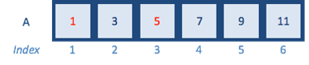
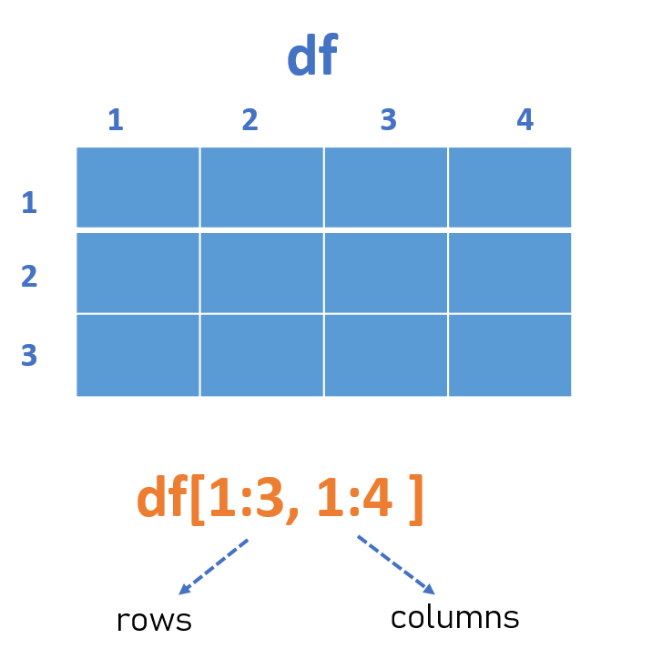

```{r setup, include=FALSE}
library(rmarkdown)
library(knitr)
library(magrittr)


knitr::opts_chunk$set(error=TRUE, color = NULL, message = FALSE)
htmltools::tagList(rmarkdown::html_dependency_font_awesome())

source("https://raw.githubusercontent.com/MPCA-air/r-modules/master/R/hook_add_color.R")
source("https://raw.githubusercontent.com/MPCA-air/r-modules/master/R/hook_add_mod.R")

```

# A New Week! {-}
<hr class="hr2">

<center>
{width=350px}
</center>

<br>

We aren't computer scientists and that's okay! 

We make lots of mistakes. Mistakes are funny. You can laugh with us.

Let's go, Simba, Pumbaa, and Timon!

<br><br><hr class="hr2">

<br>


# subset a vector
<hr>

We retrieve elements of a vector by calling an index inside a [ ] bracket operator. 
 

{width=600px}

```{r, eval=F}
A <- c(1, 3, 5, 7, 9, 11)

A[1]

A[3]

A[c(1, 5)]

A[7]

A[-3] # negative index is to remove the value 

```

<br>

If we want to find the index of certain values, the which() function works. It can take a logical vector.

```{r, eval=F}

which(A == 9) 

which(A > 5)

which(A %in% c(1, 5))

```

# subset a dataframe

A data frame is composed of rows and columns. Again we use the [ ] bracket operator to subset a dataframe. 

{width=500px}

```{r, eval=F}

head(airquality)

# select row 1, column 2
airquality[1, 2]

# select rows 1 to 2
airquality[1:2, ]

#select column 4
airquality[, 4]

```


# for loops
<hr>

Based on my data analysis experience, for loops may be the only looping construct that you will need in R.

In R, for loops take an interator variable and assign it successive values from a sequence or vector. For loops are most commonly used for iterating over the elements of an object, for example vector. 

```{r, eval=F}

# Basic for loop structure
for (interator variable in vector) {
  do something in the braces
}

# try a simple for loop
1:6 # The colon operator creates a series of numbers in sequence 

for (i in 1:6){
  print(i)
}


```
The above loop takes the i variable and each iteration of the loop gives it values 1, 2, 3, …, 6, executes the code within { }, and then the loop exits.

```{r, eval=F}

for (i in 1:length(A)){
  print(A[i])
}

for (i in seq_along(A)){ # seq_along() generates an integer sequence based on the length of A
  print(A[i])
}


for (i in A) {
  print(i)
}

sum_A <- 0

for (i in A) {
  sum_A <- sum_A + i
}

sum_A

# imagine have a simple dataframe 
df <- data.frame(
  a = rnorm(10),
  b = rnorm(10),
  c = rnorm(10),
  d = rnorm(10)
)

# We want to calculate the median of each column 
median(df$a)
median(df$a)
median(df$a)
median(df$a)

# Too many copy and paste. Instead, we can write a for loop:

median_df <- numeric(ncol(df))  # allocate sufficient space for the output

for (i in seq_along(df)) {      #sequence 
  median_df[i] <- median(df[,i]) # body
}

median_df

```


::::{.quiz data-latex="Exercise "}

__Exercise __

write a loop to compute the mean of first four columns in airquality data

::::

<br>


# Recap
<hr>

::::{.tip data-latex=""}
<br>

* subset a vector

* subset a dataframe

* for loops


::::
