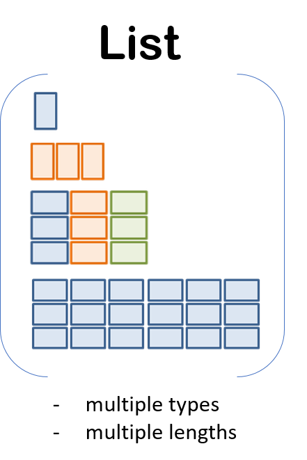

```{r setup, include=FALSE}
library(rmarkdown)
library(knitr)
library(magrittr)


knitr::opts_chunk$set(error=TRUE, color = NULL, message = FALSE)
htmltools::tagList(rmarkdown::html_dependency_font_awesome())

source("https://raw.githubusercontent.com/MPCA-air/r-modules/master/R/hook_add_color.R")
source("https://raw.githubusercontent.com/MPCA-air/r-modules/master/R/hook_add_mod.R")

```

# A New Week! {-}
<hr class="hr2">

<center>
{width=350px}
</center>

<br>

We aren't computer scientists and that's okay! 

We make lots of mistakes. Mistakes are funny. You can laugh with us.

Let's go, Simba, Pumbaa, and Timon!

<br><br><hr class="hr2">

<br>

# list - another data structure
<hr>

List is a special type of vector. It is not limited to single data type. A list can contain any mixture of data types even mixtures of data structures. 

<center>
{width=200px}

</center>

We use the list() to create a list.

```{r, eval=F}

x <- list(1, "a", TRUE) 

class(x)

x[2] # subset a list, return a list

x[[2]] # return the simpliest possible data structure

x1 <- list(1:4, 0.6, c('a', 'b'))

# how to extract element 'a' in the list x1 

```

We can also create an empty list with predefined length with the vector() function 

```{r, eval=F}
y <- vector("list", length = 5)

length(y)

```

Vectors can be converted to lists using the as.list() function

```{r, eval=F}
z <- c(1, 2, 3)

class(z)

z <- as.list(z)

class(z)
```

# apply family of functions
<hr>

R has some functions which implement looping in a compact form to make your code easier to write and to read. 

__lappy()__: takes a vector or list and applys a function on each item element. 


sapply(): Same as lapply but try to simplify the result


apply(): takes a data frame and applys a function on each row or each column of the input. 

<br>

## lapply() 

This function does the following series of operations:

1. it loops over a list, iterating over each element

2. it applies a function to each element of the list

3. returns a __list__

```{r, eval=F}
# the basic usage of lappy() function

lapply(X, FUN, ...)

X: a vector or a list(

FUN: the function to be applied

...: optional arguments to FUN
)

# calculate the mean value of each element of list x

x <- list(a = 1:5, b = rnorm(10), c = c(1, 3, NA, 7))

print(x)

y <- lapply(x, mean)

class(y)

```

Here we are passing mean() as an argument to lapply(). When we pass a function to another function, we do not need to include () like we call a function. 


Any arguments in the ... argument will get passed down to the function that applied to the list. 

```{r, eval=F}

lapply(x, mean, na.rm = T)

```

Sometime, you will see lappy() and its friends use anonymous functions. 
These are functions are generated inside lapply(). Once the call to lapply() is finished, the function disappears. 

```{r, eval=F}

# extract the 2nd value of each elements

test <- list(x = runif(5), y = rnorm(5), z = c('a', 'b', 'c', 'd', 'e' ))

test[[1]][2]
test[[2]][2]
test[[3]][2]

lapply(test, function(x){x[2]})

# using the anonymous function has the same result as the following script: 

f <- function(x){
  x[2]
}

lapply(test, f)


```

If the function is going to be used a lot in other parts of your code, you might want to define it separately. But if it's going to be used just for this call to lapply(), then it’s probably simpler to use an anonymous function.

::::{.quiz data-latex="Exercise "}

__Exercise __

Use lapply() to seperate and save airquality data by month.

::::

## sapply() 

The sapply() function behaves similarly to lapply(); the only real difference is in the return value. 

```{r, eval=F}
test <- list(a = 1:4, b = rnorm(10), c = rnorm(20, 1), d = rnorm(100, 5))

lapply(test, mean)

sapply(test, mean)
```

<br>

## apply()

This function takes a matrix or data frame and performs a function on each row or each column of the input individually (1 for rows, 2 for columns).

```{r, eval=F}
a <- data.frame(c1 = 1:3, c2 = 4:6, c3 = c(7, 8, NA))

a

# row products
apply(a, 1, function(x){prod(x, na.rm = T)})

# column products
apply(a, 2, function(x){prod(x, na.rm = T)})


```

Usually there are better alternatives for column-wise operations on data frames.


<br>


# Recap
<hr>

::::{.tip data-latex=""}
<br>

* list

* apply family of functions

::::
