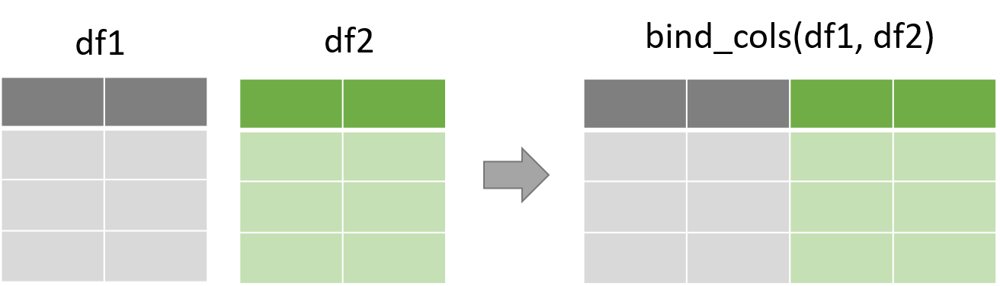
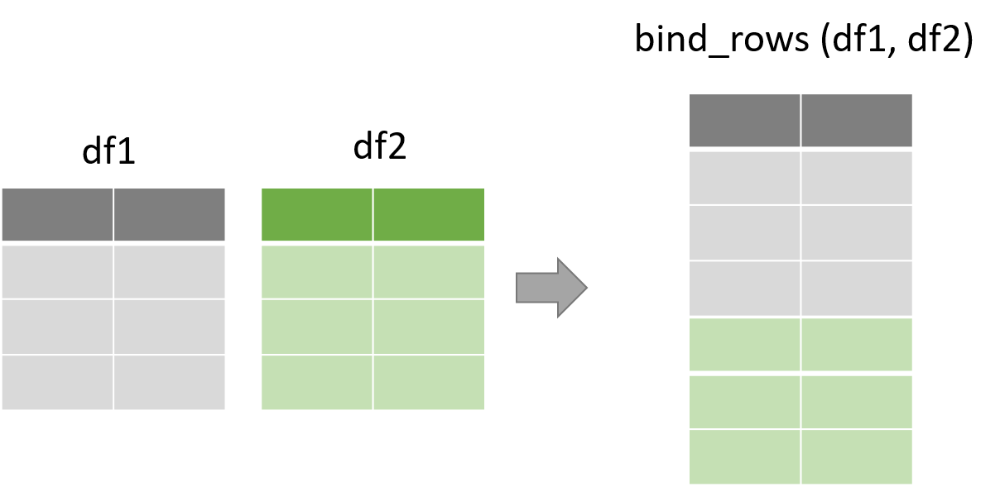
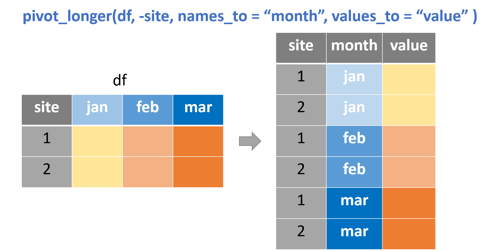
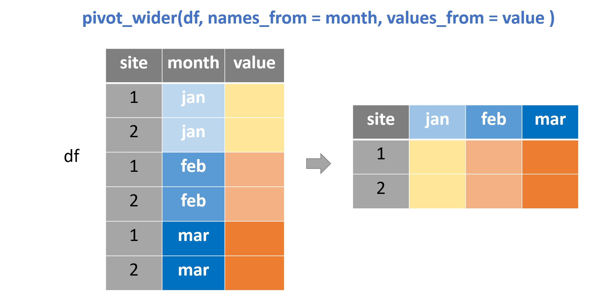

```{r setup, include=FALSE}
library(rmarkdown)
library(knitr)
library(magrittr)


knitr::opts_chunk$set(error=TRUE, color = NULL, message = FALSE)
htmltools::tagList(rmarkdown::html_dependency_font_awesome())

source("https://raw.githubusercontent.com/MPCA-air/r-modules/master/R/hook_add_color.R")
source("https://raw.githubusercontent.com/MPCA-air/r-modules/master/R/hook_add_mod.R")

```

# A New Week! {-}
<hr class="hr2">

<center>
{width=350px}
</center>

<br>

We aren't computer scientists and that's okay! 

We make lots of mistakes. Mistakes are funny. You can laugh with us.

Let's go, Simba, Pumbaa, and Timon!

<br><br><hr class="hr2">

<br>


# bind multiple data frames 
<hr>

## bind_cols() 

Bind multiple data frames by column.

All data frames must have the same number of rows.

<center>
{width=450px}

</center>

```{r, eval=F}
library(tidyverse)

one <- airquality[1:4, 1:2]
two <- airquality[9:12, 4:5]

bind_cols(one, two)

# rows are matched by position.
```

## bind_rows() 

Bind multiple data frame by rows.

<center>
{width=450px}

</center>

```{r, eval=F}

one <- airquality[1:4, 1:3]

two <- airquality[9:10, 1:3]

three <- airquality[11, 1:4] # a dataframe with four columns

bind_rows(one, two, three)

# Columns are matched by name. Missing columns will be filled with NA. 

```

# reshape data
<hr>

## pivot_longer()

We use this function to increase the number of rows and decrease the number of columns.

<center>
{width=450px}
</center>


```{r, eval=F}

# create a data frame 
df <- data.frame(site = 1:3,
                 jan = runif(3, 0, 1),
                 feb = rnorm(3, 5),
                 mar = rnorm(3, 10))

long_df <- df %>% 
  pivot_longer(-site, names_to = "month", values_to = "value" )

df %>% 
  pivot_longer(jan:mar, names_to = "month", values_to = "value")

```

cheatsheet of tidyr

https://github.com/rstudio/cheatsheets/blob/master/data-import.pdf

::::{.quiz data-latex="Exercise "}

__Exercise __

Apply the pivot_longer() function to reshape the billboard dataset

::::

## pivot_wider()

This function is the inverse transformation of pivot_longer(). 

<center>
{width=450px}
</center>

```{r, eval=F}

pivot_wider(long_df, names_from = month, values_from = value)

```


::::{.quiz data-latex="Exercise "}

__Exercise __

Use the pivot_wider() function to reshape the us_rent_income dataset

::::


# Recap
<hr>

::::{.tip data-latex=""}
<br>

* bind data frames

* pivot_longer()

* pivot_wider()

::::
