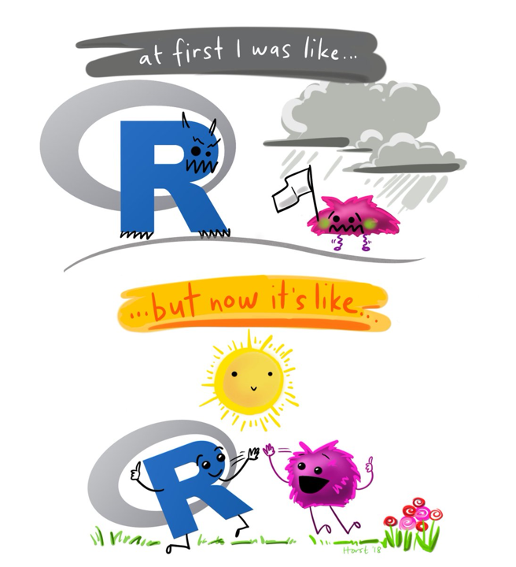

 

::::{.card data-latex=""}

 
__Welcome!__

Join us, learn R, and use your powers for good.

::::

__Goals__

* __To build R programming skills for beginners__ 

{width=550px}

__Objectives__

By the end of this training, you should be able to:

* Master the use of RStudio interactive environment

* Install R packages

* Explore and understand how to use the R documents

* Load data into R from various sources

* Undertand different data types and data structures

* Use the tidyverse packages to manipulate data frames

* Understand how to create and manipulate dates

* Create plots using ggplot2 

* __Write user-defined functions__

* Use control statements

* Write loops

* __Use apply family of functions to iterate funtions across data__

* __Reshape data__

* Join tables

* Identify and deal with missing data

* __Manipulate strings__

* __Conduct basic data analysis using R__
